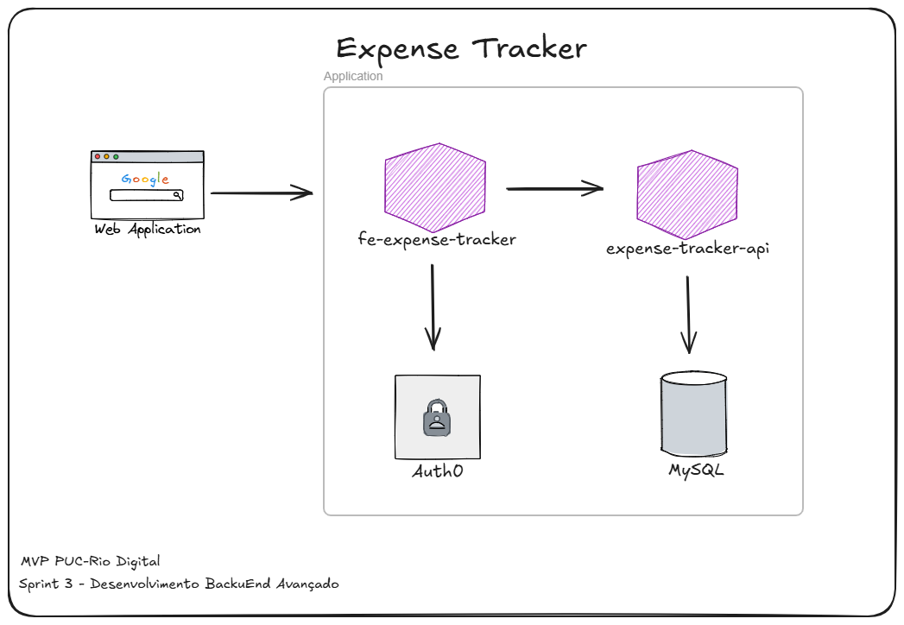

# Expense Tracker Frontend

Projeto MVP desenvolvido durante a Sprint 3 do curso de Pós-Graduação em Desenvolvimento Full Stack da PUC-Rio Digital. Foi implementado o **Cenário 1** proposto, que consiste em uma aplicação com Interface (Frontend), API (Backend) e consulta a API externa diretamente pelo Frontend. Este repositório contém o frontend da aplicação, desenvolvido em React com Vite. O backend da aplicação está disponível em um repositório separado: [Expense Tracker API](https://github.com/ismaelfarias/api-expense-tracker).

## Sobre o Projeto

A aplicação fornece uma interface intuitiva para gerenciamento de finanças pessoais, permitindo:
- Cadastro e controle de despesas
- Registro de receitas
- Categorização de transações
- Acompanhamento financeiro detalhado
- Autenticação segura de usuários

## Tecnologias Utilizadas

- **React 18**: Biblioteca JavaScript para construção de interfaces
- **Vite**: Build tool e dev server
- **React Router**: Gerenciamento de rotas
- **Auth0**: Sistema de autenticação e autorização
- **CSS Modules**: Estilização modular dos componentes

## Autenticação com Auth0

### Sobre o Auth0
O Auth0 é uma plataforma de autenticação e autorização que oferece:
- Plano gratuito com até 7.500 usuários ativos
- Múltiplos métodos de autenticação
- SDK para React e outras tecnologias
- Interface customizável para login/cadastro

### Configuração Necessária

1. Criar uma conta gratuita em [Auth0](https://auth0.com/)
2. Criar uma nova aplicação Single Page Application
3. Configurar URLs permitidas:
   - Allowed Callback URLs: `http://localhost:5173`
   - Allowed Logout URLs: `http://localhost:5173`
   - Allowed Web Origins: `http://localhost:5173`

### Rotas Protegidas
As seguintes rotas requerem autenticação:
- `/` - Página inicial
- `/expenses` - Gerenciamento de despesas
- `/incomes` - Gerenciamento de receitas
- `/categories` - Gerenciamento de categorias

### Fluxo de Autenticação
1. Usuário acessa a aplicação
2. Redirecionamento para login do Auth0 se não autenticado
3. Após autenticação bem-sucedida, redirecionamento para a aplicação
4. Token JWT armazenado para requisições subsequentes

### Funcionalidades Implementadas
- Login com email/senha
- Login com Google (opcional)
- Logout
- Proteção de rotas
- Persistência de sessão

## Arquitetura da Solução

A aplicação frontend se comunica com uma API RESTful separada (expense-tracker-api), desenvolvida em **Python** com **FastAPI**, e utiliza o **Auth0** para gerenciamento de autenticação e autorização de usuários.



## Estrutura do Projeto
```
fe-expense-tracker
├── src
│   ├── components
│   │   ├── AddButton
│   │   ├── FormModal
│   │   ├── Header
│   │   └── ...
│   ├── pages
│   │   ├── Home
│   │   ├── Categories
│   │   ├── Expenses
│   │   └── Incomes
│   ├── App.jsx
│   └── main.jsx
├── public
├── package.json
└── README.md
```

## Configuração e Execução

### Pré-requisitos
- Node.js 18.x ou superior
- npm (gerenciador de pacotes Node.js)
- Conta no [Auth0](https://auth0.com/) para configuração de autenticação

### Variáveis de Ambiente

Crie um arquivo `.env` na raiz do projeto:
```
VITE_AUTH0_DOMAIN=seu-dominio.auth0.com
VITE_AUTH0_CLIENT_ID=seu-client-id
```

### Instalação

```bash
npm install
```

### Execução em Ambiente de Desenvolvimento

```bash
npm run dev
```

## Execução com Docker

### Pré-requisitos
- Docker instalado
- Docker Compose instalado

### Comandos Docker

Para construir e executar o container:

```bash
# Construir a imagem
docker build -t expense-tracker-frontend .

# Executar o container
docker run -e AUTH0_DOMAIN=seu-dominio.auth0.com -e AUTH0_CLIENT_ID=seu-client-id -p 5173:80 expense-tracker-frontend
```

Ou usando Docker Compose:

```bash
# Construir e executar
docker-compose up

# Executar em background
docker-compose up -d

# Parar os containers
docker-compose down
```

Após a execução, acesse a aplicação em: `http://localhost:5173`

## Recursos Implementados

- [x] Autenticação com Auth0
- [x] Gestão de categorias
- [x] Controle de despesas
- [x] Registro de receitas
- [x] Interface responsiva
- [x] Proteção de rotas

## Próximos Passos

- [ ] Adicionar testes automatizados
- [ ] Melhorar a documentação
- [ ] Implementar dashboard com gráficos
- [ ] Criar relatórios personalizados
- [ ] Adicionar temas claro/escuro

## Como Contribuir

1. Faça um fork do repositório
2. Crie uma branch para sua feature
   ```bash
   git checkout -b feature/NovaFuncionalidade
   ```
3. Realize as alterações necessárias
4. Faça commit das mudanças
   ```bash
   git commit -m 'Adiciona nova funcionalidade'
   ```
5. Envie para a branch
   ```bash
   git push origin feature/NovaFuncionalidade
   ```
6. Abra um Pull Request

## Licença

Este projeto está licenciado sob a MIT License - consulte o arquivo `LICENSE` para mais detalhes.

## Contato

Link do projeto: [https://github.com/ismaelfarias/fe-expense-tracker]